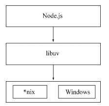

[👈](./index.md)

## Node.js 介绍

### Node.js 是什么

- Node.js® is a JavaScript runtime built on [Chrome's V8 JavaScript engine](https://v8.dev/).
  - Node.js 不是一门语言
  - Node.js 不是库、不是框架
  - Node.js 是一个 JavaScript 运行时环境
  - Node.js 可以解析和执行 JavaScript 代码，以前只有浏览器可以解析执行 JavaScript 代码
  - Node.js 构建于 Chrome V8 引擎之上
  
- 浏览器中的 JavaScript 
  - ECMAScript
  - BOM
  - DOM 
  
- Node.js 中的JavaScript
  - **没有 BOM 、DOM**
  - ECMAScript
  - 服务端相关 API，文件读写、网络服务等
  
- Node.js uses an event-driven, non-blocking I/O model that makes it lightweight and efficient
  - **事件驱动** 
  - **非阻塞 I/O 模型**
  - **轻量高效**
  
- Node保持了JavaScript在浏览器中单线程的特点
  - 无法利用多核CPU
  - 错误会引起整个应用退出
  - 大量计算占用 CPU 导致无法继续调用异步 I/O
  
- 跨平台

  - Node基于libuv实现跨平台

    

- Node.js' package ecosystem, [npm](https://npmjs.com), is the largest ecosystem of open source libraries in the world.
  
  - npm 是世界上最大的开源库生态系统，涵盖了绝大多数的 JavaScript lib
  

> 我喜欢《深入浅出NodeJS》里面的一句话：“如果HTTP协议栈是水平面，Node就是浏览器在协议栈另一边的倒影”。很形象的阐述了 Node 和 JavaScript 以及浏览器的关系。

### Node.js 能做什么

- 服务器
- 命令行工具
  - npm
  - 

### 预备知识

- HTML
- CSS
- JavaScript
- 简单的命令操作
  - cd
  - dir
  - ls
  - mkdir
  - rm

### 学习资源

- 《深入浅出Node.js》
  - 偏底层、偏理论
  - 对理解底层原理有帮助
- 《Node.js 权威指南》
  - API 讲解
- JavaScript 标准参考教程（alpha）：https://javascript.ruanyifeng.com/
- Node 入门：https://www.nodebeginner.org/index-zh-cn.html
- 官方 API 文档：https://nodejs.org/dist/latest-v12.x/docs/api/
- CNODE 社区：https://cnodejs.org/
- CNODE 新手入门：https://cnodejs.org/getstart

