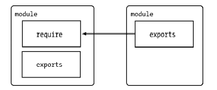

[👈](./index.md)

## 模块系统

### CommonJS 规范

每个单独的文件可以被看做是独立的模块。每个模块拥有独立的作用域，模块之间无法直接访问成员变量。只能通过导出和引用的方式进行模块间的通信。在每一个模块内部都定义了一个 module 对象，模块的导出就是通过这个对象的 exports 属性来实现的。



1. 模块引用

   使用 `require()` 方法引用模块。

2. 模块定义

   使用 `module.exports = {} ` 对象定义导出的方法或变量。`module` 是模块本身。

3. 模块标识

   模块标识其实就是传递给 require() 方法的参数，它必须是符合小驼峰命名的字符串，或者 以.、..开头的相对路径，或者绝对路径。它可以没有文件名后缀.js。

   

### Node 的模块实现

#### 模块分类

Node.js 中一共有两种模块，核心模块和文件模块。

1. 核心模块

   核心模块部分在Node源代码的编译过程中，编译进了二进制执行文件。在Node进程启动 时，部分核心模块就被直接加载进内存中。Node.js 中有以下几种常见的核心模块：

   - fs：文件的读写等操作；
   - http：搭建服务器相关 API；
   - path：对文件路径操作的 API；
   - os：系统相关信息的 API；
   - url：操作 URL 信息的API

2. 文件模块

   文件模块就是程序员自己创建的一个 js 文件，一个单独的 js 文件就可以看作一个单独的模块，在需要导入的文件中通过 `require('./a.js')`。

   

#### 模块定义

Node.js 中没有全局作用域，只有模块作用域，内部的变量只会在当前为文件模块中访问。模块中有一个预定义的对象 exports ，只有挂载在 exports 上的变量才可以被外部模块访问。实际上 require 的返回值就是对应模块对象中的 exports 。

```javascript
// 变量 bar，不可以直接在外部文件中访问，只有挂载到 exports 上，才可以被访问。 
const bar = 'bar'
exports.bar = bar
exports.foo = function () 
```


#### 模块引用

```javascript
const fs = require('fs')
const a = require('./a.js')
```

在Node中引入模块，需要经历如下3个步骤。 

1. 路径分析 
2. 文件定位
3. 编译执行

调用 require 方法，其实就是执行了模块中的代码，所以外部模块中的顶层代码会先于 require 之后的语句执行 ，同时返回模块的 exports 属性。但是只有在模块文件第一次被引用时才会被执行。执行过程如下：

1. 解析文件路径；
   1. 如果是核心模块，直接返回核心模块名称；
   2. 如果是绝对路径或者相对路径，直接查找对应文件或文件夹；
      1. 如果不是文件夹，尝试查找对应文件，如果文件不存在，尝试查找是否是以 `.js` `.json` `.node` `.mjs` 结尾的文件，如果找不到就报错；
      2. 如果是文件夹，尝试找到 package.json 下的 main 属性，查找对应的文件或者对应文件夹下的 index 文件，如果找不到 main 属性或者 main 属性对应的文件找不到，则返回当前文件夹下的 index 文件，如果找不到就报错；
   3. 否则，遍历每一层父级文件夹中的 node_modules 和全局 node_modules 目录，按照第二种方式进行查找，直到找到对应文件。
2. 判断缓存中是否存在；
3. 如果有缓存，则返回 exports；
4. 如果没有缓存，尝试从核心模块中查找；
5. 如果是核心模块则返回 exports；
6. 如果不是，创建 module 对象，缓存对象，然后加载并执行模块，返回 exports 。


